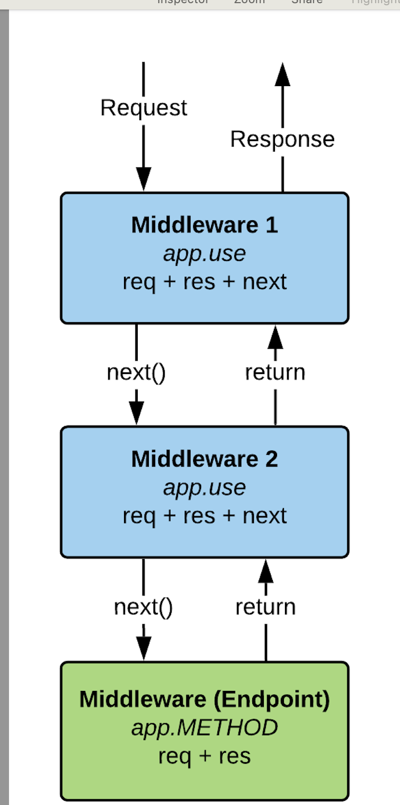

## Commit-7_Express

### Documentation and Background
1. [Stack-Overflower developer survey](https://survey.stackoverflow.co/).In May 2024 over 65,000 developers responded to our annual survey about coding, working, AI and how they feel about all of those topics and more.
2. [Express Doc](https://expressjs.com/). Express is a minimal and flexible Node.js web application framework that provides a robust set of features for web and mobile applications.
3. [Express git](https://github.com/expressjs/express). Website and Documentation - [website repo]
[GitHub Organization](https://github.com/expressjs/express/blob/master/Readme.md) for Official Middleware & Modules. Github .Discussions for discussion on the development and usage of Express
PROTIP Be sure to read the migration guide to v5.
4. [Koa](https://github.com/koajs/koa). -Expressive middleware for node.js using ES2017 async functions.
5. [Koa vs Express](https://github.com/koajs/koa/blob/master/docs/koa-vs-express.md).
6. [Next.js](https://nextjs.org/).
7. [Server side rendering](https://blog.logrocket.com/improve-app-performance-react-server-side-rendering/)
8. [POSTMAN](https://www.postman.com/).- Postman doc
9. [insomnia](https://insomnia.rest/). - Insomnia doc
10. . - Middlware flow.
11. [Model–view–controller](https://en.wikipedia.org/wiki/Model%E2%80%93view%E2%80%93controller).- Model–view–controller (MVC) is a software design pattern commonly used for developing user interfaces that divides the related program logic into three interconnected elements. These elements are:the model, the internal representations of information
the view, the interface that presents information to and accepts it from the userthe controller, the software linking the two.
12. [CRUD](https://restapitutorial.com/resources) - FOR RESTFUL API CRUD SEQUENCE.

# 🚀 Express Project

## 📌 Overview

This is a **Node.js Express** project that provides an API for managing friends and messages. It follows a structured **MVC pattern** with separate controllers, models, and routes. The project also includes Handlebars (`.hbs`) views for rendering pages.

---

## 📂 Project Structure
express-project/ │── controllers/ # Controller logic for handling requests │ ├── friends.controller.js │ ├── messages.controller.js │ │── models/ # Data models │ ├── friends.model.js │ │── routes/ # Route handlers │ ├── friends.router.js │ ├── messages.router.js │ │── views/ # Handlebars (HBS) views │ ├── layout.hbs │ ├── index.hbs │ ├── messages.hbs │ │── public/ # Static assets (CSS, images) │ ├── css/style.css │ ├── images/skimountain.jpg │ │── server.js # Main entry point for Express server │── package.json # Project metadata and dependencies │── README.md # Documentation

---

## 🛠️ Installation & Setup

### 1️⃣ Clone the Repository

```sh
git clone https://github.com/yourusername/express-project.git
cd express-project

2️⃣ Install Dependencies
Run the following command to install necessary packages:

sh
Copy
Edit
npm install
3️⃣ Run the Server
Start the server using:

sh
Copy
Edit
npm start
or with nodemon (for automatic reloads during development):

sh
Copy
Edit
npm run dev
📜 API Endpoints
Friends API
Method Endpoint Description
GET /friends Retrieve all friends
GET /friends/:friendId Retrieve a specific friend by ID
POST /friends Add a new friend
Messages API
Method Endpoint Description
GET /messages Returns an HTML message page
📜 Handlebars Views
The project uses Handlebars (hbs) as the templating engine.

Homepage: views/index.hbs
Messages Page: views/messages.hbs
Layout: views/layout.hbs
🔗 Example API Requests (Postman)
1️⃣ Get All Friends
Request:
http
Copy
Edit
GET http://localhost:3000/friends
Response:
json
Copy
Edit
[
  { "id": 0, "name": "Albert Einstein" },
  { "id": 1, "name": "Sir Isaac Newton" }
]
2️⃣ Get a Specific Friend
Request:
http
Copy
Edit
GET http://localhost:3000/friends/1
Response:
json
Copy
Edit
{ "id": 1, "name": "Sir Isaac Newton" }
3️⃣ Add a New Friend
Request:
http
Copy
Edit
POST http://localhost:3000/friends
Body (JSON):
json
Copy
Edit
{ "name": "Galileo Galilei" }
Response:
json
Copy
Edit
{ "id": 2, "name": "Galileo Galilei" }
🚀 Technologies Used
Node.js - JavaScript runtime
Express.js - Web framework
Handlebars.js - Templating engine
Nodemon - Auto-reloading during development
📝 License
This project is licensed under the ISC License.

